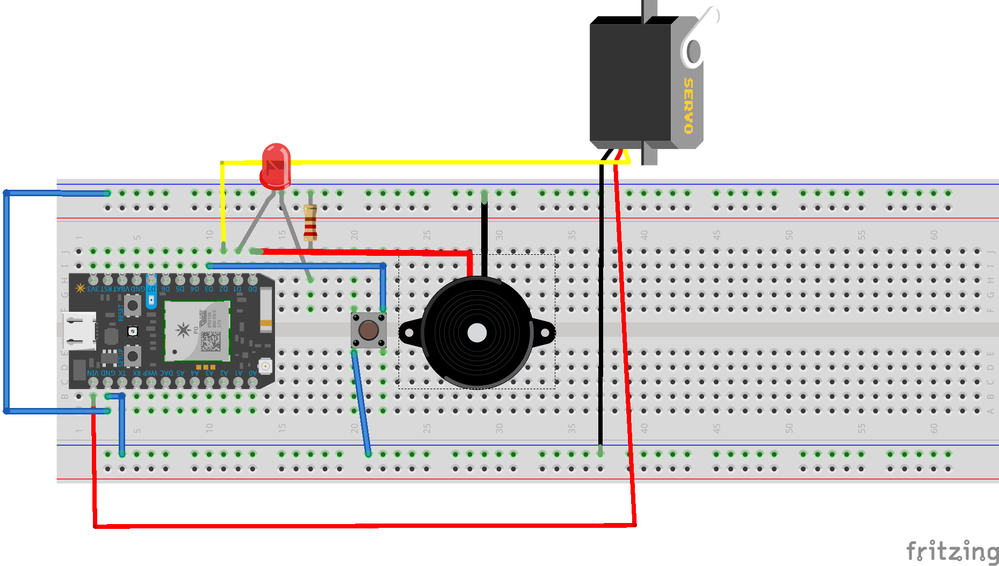
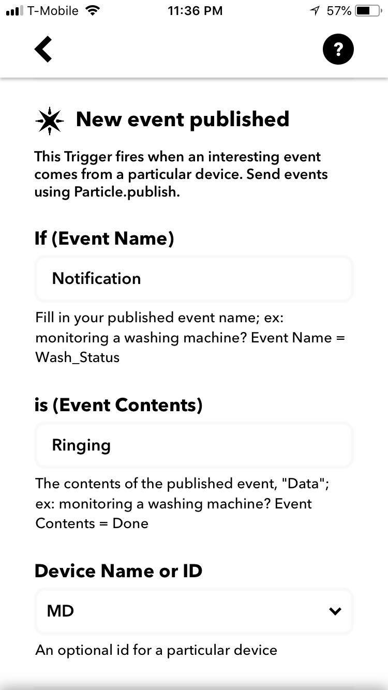

# Guide for developer

***Tool:***
1. Photon particle
2. Servo motor
3. LED
4. Resistor
5. Piezo buzzer
6. Wires
7. Button
8. IFTTT mobile app

***Hardware setup:***

***Further Explanation:***
- In DoorbellController/lib/src contains hardware API functions and their declarations. They include ones to open/close the door, lock/unlock the button and so on. Modification to hardware should result in modification in `DoorbellHardware.h` and `DoorbellHardwareProxy.cpp`.

- Set up IFTTT notification. Hitting the button should trigger the event, therefore sending notification to the IFTTT app.

- In the `.ino` file, there are 2 cloud functions namely `doorButtonPress` and `lockButtonPress`. Hitting the UI buttons should call those 2 accordingly to update the hardware.

- Whenever any state/information is updated, `publishState` is called to publish the door's state, updating both the UI and hardware accordingly.

- There are 2 states of the door (closed and open). Hitting the door button will switch the state accordingly

- The UI will get the state of the door to display appropriately. If the door is open, the lock button is disabled. If the door is locked, the door button is disabled.

