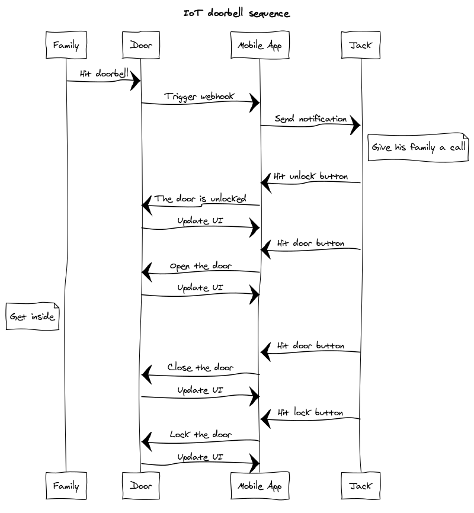

# User Guide

***Sequence example:***

***Functionality:***
- Hitting the doorbell button will send a notification to our mobile app.
- If the door is locked, the door button is disabled. So, you need to unlock the door for any further action. Hit the lock button will unlock the door.
- After the door is unlocked, you are now able to open the door by simply hitting the door button.
- When the door is opened, the lock button is disabled. Hitting the door button again should close the door.